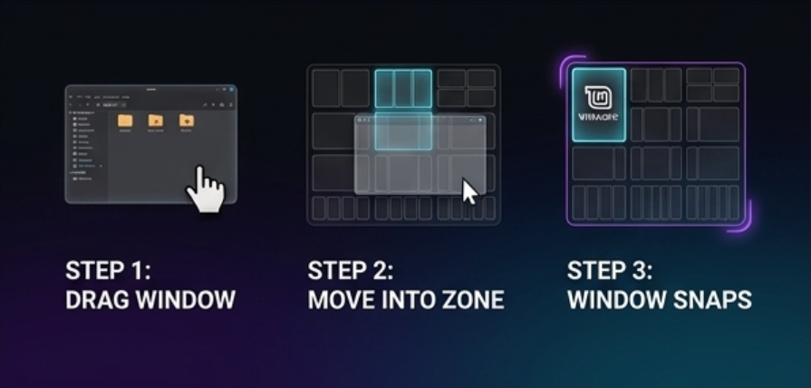
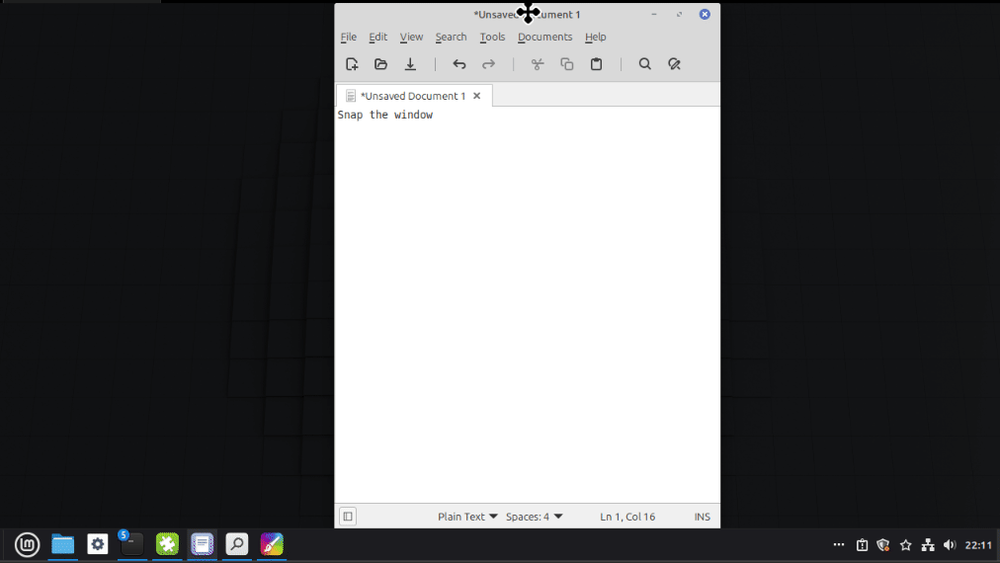
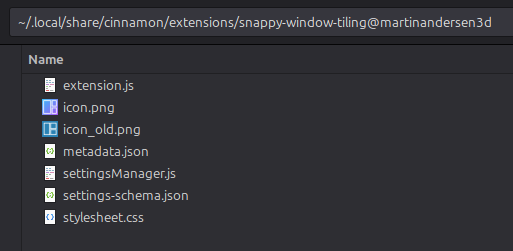
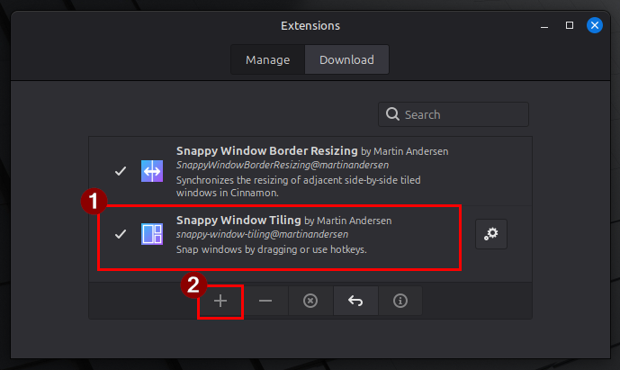

# Snappy Window Tiling - Linux Mint Cinnamon Extension
**Snappy Window Tiling** is a powerful grid-based window management extension for Linux Mint (Cinnamon Desktop). 
Effortlessly organize your windows with mouse-drag overlay zones or fast keyboard navigation.





---

## Features

* **Grid & Split Layouts:** Choose from classic half-splits, 3-column layouts, 3x3 grids, 4x4 grids, ultra-wide 5x4 grids, and equal vertical columns.

* **Mouse Drag Snap:** 
  * Hold/drag your window to view visual snap zones dynamically.
  * **Multi-Zone Selection:** Hold `Shift` to span windows across multiple adjacent grid cells simultaneously.
* **Keyboard:** 
  * Open with keyboard  `Win+z` / `Super+z` 
  * Use arrow keys or number keys.
  * **Multi-Zone Selection:** Hold `Shift` to span windows across multiple adjacent grid cells simultaneously.
* **Multi-Monitor Ready:** Automatically detects pointer location to display overlay and target grids on the active monitor.
---

## Usage

### 🖱️ Mouse-Drag Mode
1. Drag any window titlebar.
2. Overlay zones display on screen. Hover over your desired target zone and release the mouse button to snap.
3. *(Optional)* Hold `Shift` while hovering to select multiple zones simultaneously.

### ⌨️ Keyboard Mode
1. Press your configured hotkey (e.g., `Super + z` or custom binding).
2. **Step 1:** Select a **Layout Group** using digits `1`–`9` (or `0` for 10th), or navigate with **Arrow Keys** and press `Enter`.
3. **Step 2:** Select a target **Zone Tile** using digit keys or arrow keys.
4. *(Optional)* Hold `Shift` while moving arrow keys to select a region spanning multiple tiles. (Hold `Shift` down, while you press `Enter` to complete)
5. Press `Enter` to snap!


---

## Installation

<!-- ### Option 1: Via Cinnamon Spices (Recommended)
1. Open **System Settings** -> **Extensions**.
2. Click the **Download** tab.
3. Search for **Snappy Window Tiling**.
4. Click **Install**, then activate it under the **Manage** tab. -->

### Manual Installation
#### STEP 1:  Paste this into your terminal:
```bash
curl -L https://github.com/martinandersen3d/LinuxMintWindowSnapZoneTiling/archive/refs/heads/master.zip -o /tmp/ext-swb.zip \
  && unzip /tmp/ext-swb.zip "LinuxMintWindowSnapZoneTiling-master/snappy-window-tiling@martinandersen3d/files/snappy-window-tiling@martinandersen3d/*" -d /tmp/ext-swb \
  && mv "/tmp/ext-swb/LinuxMintWindowSnapZoneTiling-master/snappy-window-tiling@martinandersen3d/files/snappy-window-tiling@martinandersen3d" \
        ~/.local/share/cinnamon/extensions/ \
  && ls ~/.local/share/cinnamon/extensions/snappy-window-tiling@martinandersen3d \
  && echo "[SUCCES] Installation successful!" || echo "[FAILED] Installation failed — files not found."
```

https://github.com/martinandersen3d/LinuxMintWindowSnapZoneTiling

#### STEP 2: Check files is installed at the correct location:
- `~/.local/share/cinnamon/extensions/snappy-window-tiling@martinandersen3d`


#### STEP 3: System Settings → Extensions
1. Open **System Settings → Extensions** and click `Snappy Window Tiling`
2. Click the `+` plus. The `✔️` checkmark should appear.



---

## ⚙️ How to Customize the Hotkey

You can easily change the shortcut key used to trigger the overlay:

1. Open **System Settings** -> **Extensions**.
2. Locate **Snappy Window Tiling** under the **Manage** tab.
3. Click the **Gear icon** (⚙️) next to the extension to open its settings window.
4. Click on the **Toggle Overlay Shortcut** field and press your preferred key combination (e.g., `<Super>z`).
5. The shortcut updates immediately—no system restart required!

### Features

| Setting | Default | Description |
| :--- | :---: | :--- |
| **Enable drag-to-snap** | ✅ On | Show the zone overlay when dragging a window by its titlebar. Disable this if you only want keyboard-based snapping. |
| **Enable keyboard hotkey** | ✅ On | Register the global hotkey that opens the overlay for the focused window. Disable this if you only want drag-to-snap. |

### Keyboard Shortcuts

| Setting | Default | Description |
| :--- | :---: | :--- |
| **Hotkey** | `Super + Z` | The global key combination that triggers the overlay. Click the field and press any key combination to change it. Changes take effect immediately — no restart required. |


---

# Video

### Intro:

<video src="https://github.com/user-attachments/assets/e2b41e14-1913-4e71-a6f9-a2d0c9555e4b" controls width="100%">
  Your browser does not support the video tag.
</video>

### Hold `SHIFT` while you mouse drag to Multi-Select:
<video src="https://github.com/user-attachments/assets/f112f0b4-b67c-4063-8df2-08797c61ba3c" controls width="100%">
  Your browser does not support the video tag.
</video>

### Hotkey Win+z to Activate and use keyboard Digits to Navigate:
<video src="https://github.com/user-attachments/assets/c90b9a84-17af-4a46-bcfc-4dd377a599e9" controls width="100%">
  Your browser does not support the video tag.
</video>

### Hotkey Win+z to Activate and use keyboard Arrows to Navigate:
<video src="https://github.com/user-attachments/assets/f2a2ab83-7ba6-4729-9da3-96bb84b92414" controls width="100%">
  Your browser does not support the video tag.
</video>


